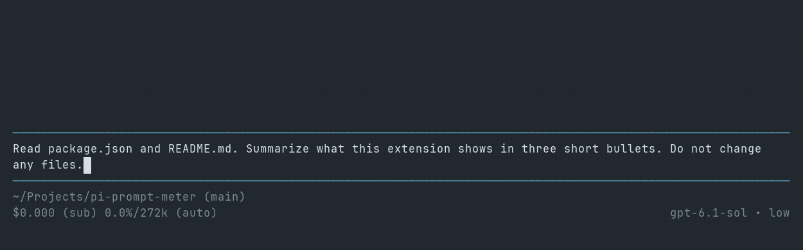

# pi-prompt-meter

A tiny Pi extension that shows how much time and model usage each prompt consumes.



```text
Working · 00:22 · ↑12k ↓640 R210k · ↻3 TC7 Cmp1 · $0.004 (sub)
```

When the prompt ends, its settled meter is labeled `Prompt Meter`, `Canceled`, or `Error`.

## Install

```bash
pi install npm:pi-prompt-meter
```

If Pi is already running:

```text
/reload
```

## Metrics

| | |
| --- | --- |
| `00:22` | Time spent on the prompt |
| `↑` | Input tokens |
| `↓` | Output tokens |
| `R` | Cache-read tokens |
| `W` | Cache-write tokens, when present |
| `↻` | Pi turns (one LLM turn plus its tool executions) |
| `TC` | Tool executions, including nested tool calls |
| `Cmp` | Compactions during the prompt |
| `$` | Estimated cost |

Each new prompt starts one live `Working` meter. It disappears when the prompt settles. Turn, tool-call, and compaction counts come from Pi lifecycle events and are recorded exactly for new prompts.

Each settled meter appears once in the transcript as `Prompt Meter`, `Canceled`, or `Error`, with all three counters. Pi custom entries store these rows without adding them to LLM context. Completed rows remain in scrollback after another prompt or `/reload`. Older history-only records remain hidden in the transcript and available in History and Trends.

If persistence fails, the extension shows a warning instead of a final widget or a second append attempt. If the entry renderer fails, Pi shows an error on that entry. Neither failure creates another meter.

## History

Run `/meter` in Pi's interactive TUI to browse prompt usage for the current project. History shows one month at a time:

```text
History   Trends
‹ September 2026 ›
```

Use left/right to page months. History groups each session as a summary row with its prompts permanently nested underneath, in a `/resume`-style scrollable list. Up/down selects prompts only; Enter jumps to the selected prompt's Pi session-tree location. New prompts use the same exact meter records that render in the transcript. Older Pi sessions are reconstructed from saved history; approximate durations are marked with `≈`.

`Trends` keeps date as the primary unit and shows `Time`, `Input`, `Output`, `Cache`, `Cost`, and a Time-based activity bar together. The only control is range: `7d`/`30d` group by day, `3mo`/`6mo` by week, and `1y`/`All` by month.

## Requirements

- Pi `>= 1.0.0`
- Node.js `>= 22.19.0`
- `/meter` requires Pi's interactive TUI

## License

MIT
